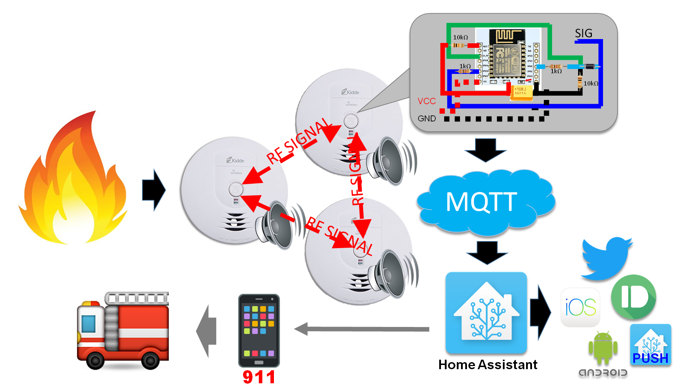
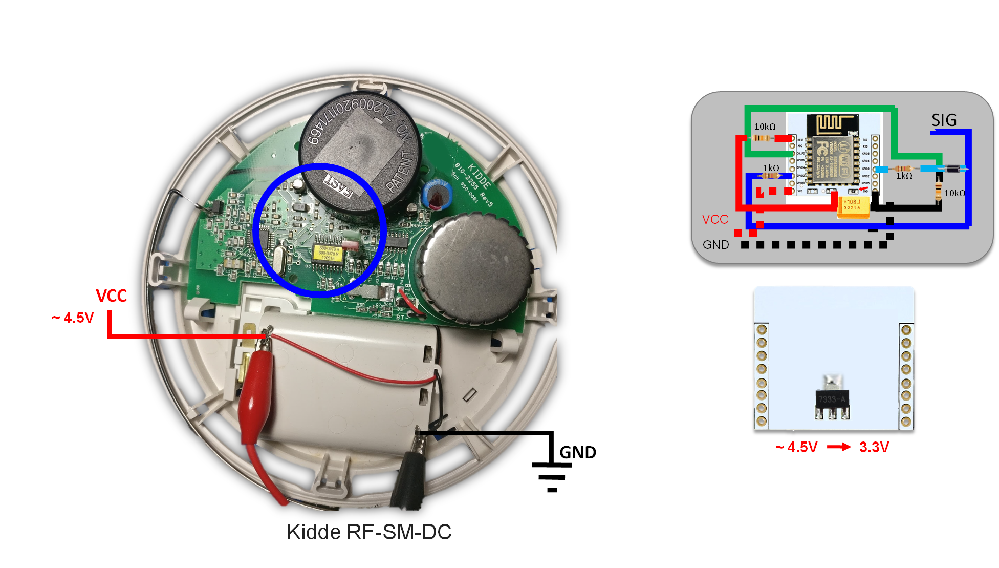
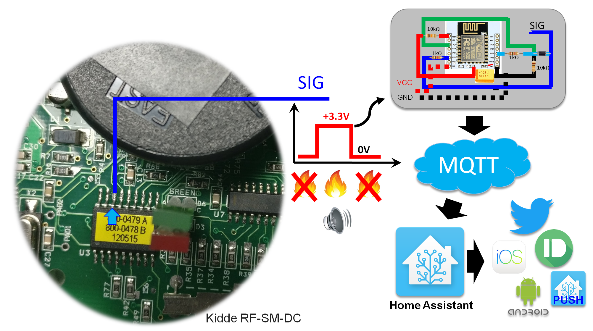

# Internet_Fire_Alarm
Connecting a ESP8266 to Kidde Smoke/Fire Alarm System. ESP8266 sends a MQTT message until the smoke alarm is beeping.

Refer to https://github.com/debsahu/ESP_External_Interrupt to build the ESP8266 part of the internet connected smoke alarm.

Overall idea is to detect smoke alarm signals and send MQTT message. Home Assistant reads the MQTT message and sends out notifications that can be used to notify your local fire station.

We will be hacking into Kidde RF-SM-DC

Zoomed Kidde RF-SM-DC's location of 3.3V signal 

